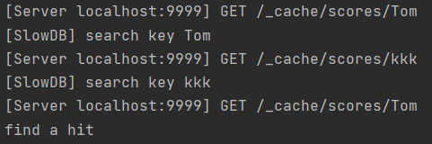

# AlpineCache
Go语言编写的分布式缓存。支持缓存的基本功能，包括查询，本地获取，缓存淘汰，并发查询等。  
通过Go语言test机制，进行单元测试，模拟使用情况。
## 关键词
* 单机缓存和基于 HTTP 的分布式缓存
* 使用最近最少访问(LRU) 缓存策略
* 使用一致性哈希选择节点
* 利用锁控制单次查询，防止缓存击穿
## 基本流程

## 部分流程讲解
每一个cache节点要新建一个httpPool，每个cache的group里面，httpPool也就是group中"peers PeerPicker"是不一样的，是自己的httpPool。
```
//apiserver的路径等可以单独修改，对外暴露。这是apiserver发起group.Get请求
//apiserver和cache的区别是apiserver的group没有设定group.RegisterPeers，是无法正常工作的
//但当cacheServer设置后，同一个group的apiserver就可以工作了。
//换句话说这里是为了方便测试，一组group中，一定要有一个api为true，才能正常使用api功能。
//如果不启用api，直接向cacheServer发送符合cacheServer的URL也行。
func startAPIServer(apiAddr string, group *alpineCache.Group) {
...
}
```
apiserver调用group.Get去获取缓存
* 结果1，当前节点直接找到对应的key，直接返回
* 结果2，当前节点没找到，调用load。load函数计算key本应落在哪个节点
  * 结果1，key本应落在其它节点，调用getFromPeer去其它节点找
    * 通过对应的httpgetter里的get方法(注1)，对目标节点触发group.Get。从头循环。（这次即使还是没找到，load函数也会发现本应落在自己这个节点，于是触发本地获取，不会无限循环）
  * 结果2，key本应落在自己节点，说明缓存里确实没有，调用fromlocal从本地获取缓存数据添加进去
    
注1：Apiserver和httpgetter的get触发group.get的区别。apiserver对外界开放，单独写出来，这样用户请求的URL可以很方便的修改。httpgetter的get

## 部分运行结果
通过HTTP发送请求


待续...