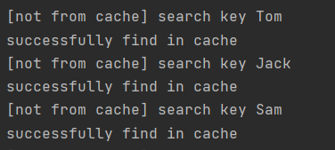
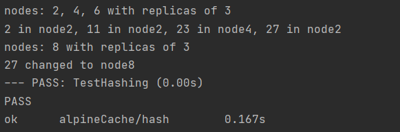

# AlpineCache
Go语言编写的分布式缓存。支持缓存的基本功能，包括查询，本地获取，缓存淘汰，并发查询等。  
通过Go语言test机制，进行单元测试，模拟使用情况。

## 关键词
* 单机缓存和基于 HTTP 的分布式缓存
* 使用最近最少访问(LRU) 缓存策略
* 使用一致性哈希选择节点
* 利用锁控制单次查询，防止缓存击穿

## 基本流程
启动Cache后，接到缓存查询请求，返回结果。  
可启动多个节点，任意节点都可以接收http请求，也可以在任意节点单独暴露一个apiserver特殊处理。  
若当前节点没有找到，会自动请求对应的节点，若整个分布式各节点都没有，本地查询（模拟向DB查询）。

## 部分流程说明
* HTTPPool：每一个cache节点要新建一个httpPool，每个cache的group(中心结构)里面，httpPool也就是group中"peers PeerPicker"是不一样的，是自己的httpPool。  

* apiserver调用group.Get去获取一次缓存的流程：
  * 结果1，当前节点直接找到对应的key，直接返回
  * 结果2，当前节点没找到，调用load。load函数计算key本应落在哪个节点
    * 结果A，key本应落在其它节点，调用getFromPeer去其它节点找 
      * 通过对应的httpgetter里的get方法(注)，对目标节点触发group.Get。从头循环。（这次即使还是没找到，load函数也会发现本应落在自己这个节点，于是触发本地获取，不会无限循环）
    * 结果B，key本应落在自己节点，但之前已经没找到，说明缓存里确实没有，调用fromlocal从本地获取缓存数据添加进去
  
注：Apiserver和httpgetter的主要区别只是对外界开放与否。httpgeter->http.Get(Go库)->serveHTTP->Group.get殊途同归（具体可参加代码及注释）。单独写出来，这样对用户暴露的URL可以很方便的修改。

* onlySendOnce：当一个key正在被查询时，查询相同key的请求全部被挂起，直接等待结果返回。

## 部分运行测试结果
测试若存在缓存则返回，不存在则从本地获取。下图第二次请求直接返回find in cache。  


测试一致性hash加入节点。  


run.sh模拟分布式节点，使用Http发送请求。  
并测试onlySendOnce。数个相同key的请求同时发出，若不在cache中，只会同时本地获取一次，其它请求直接等待结果。  
```
cache is running at http://localhost:8000
cache is running at http://localhost:8002
frontend server is running at http://localhost:9000
cache is running at http://localhost:8001
>>> start getting from cache

[Server http://localhost:8002] Pick node(peer) from http://localhost:8000
[Server http://localhost:8000] GET /_cache/scores/Tom
[Simulate Database] Get from database with key of Tom

>>> retrieve once more
[Server http://localhost:8002] Pick node(peer) from http://localhost:8000
[Server http://localhost:8000] GET /_cache/scores/Tom
successfully find in cache
[Server http://localhost:8002] Pick node(peer) from http://localhost:8000
[Server http://localhost:8000] GET /_cache/scores/Tom
successfully find in cache
[Server http://localhost:8002] Pick node(peer) from http://localhost:8000
[Server http://localhost:8000] GET /_cache/scores/Tom
successfully find in cache
```